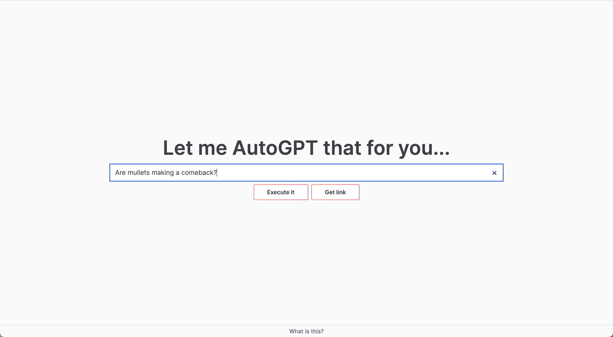
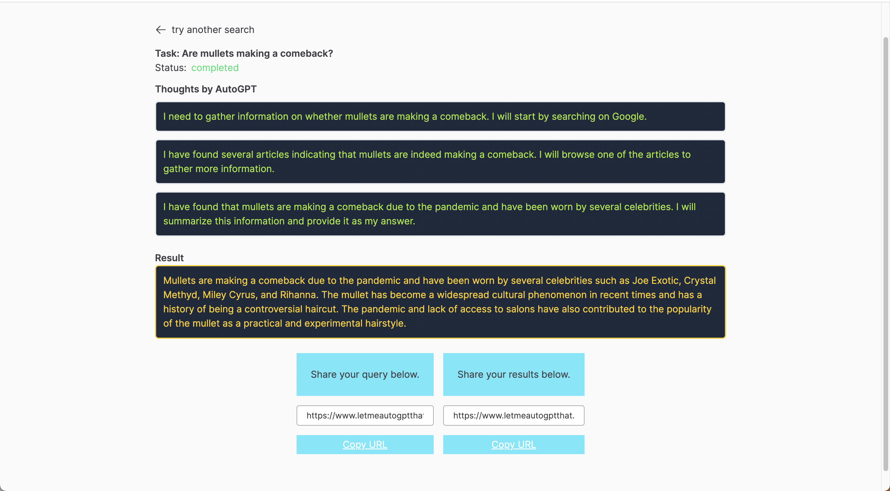

# LetMeAutoGPTThat: Let me Google that, but for AutoGPT

LetMeAutoGPTThat is a collection of packages to run a web app that spins up AutoGPT instances to answer user queries in a [letmegooglethat](https://letmegooglethat.com/) style.

Demo at: https://www.letmeautogptthat.com/

## App Flow

The app follows these steps

1. User enters query in website
2. A database job record is created
3. A task runner polls for newly created jobs
4. Task runner spins up a docker container with AutoGPT that gets task info and processes it
5. Profit ???

## Repositories

The following is a brief summary of each repository, check out the README in each for more details.

The code assumes you are using [Supabase](https://supabase.com/) for your database and [Vercel](https://vercel.com/) to deploy web.

### agent

An Auto-GPT-like implementation based on [Langchain](https://python.langchain.com/). Easier to modify than
Auto-GPT, but produces slightly worse results at the moment.

### Auto-GPT

A copy of [Auto-GPT](https://github.com/Significant-Gravitas/Auto-GPT) based on release 0.3.0 with some slight modifications to make it easier to record data in Supabase.

### task_runner

A simple python file to launch Auto-GPT / agents. It polls the database for new jobs and spins up a docker container for each one.

### web

A [nextjs](https://nextjs.org/) app that creates jobs based on queries and displays them.
